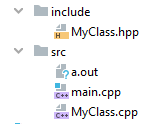

# Compiler Flags

## gcc vs g++

The main differences:

* gcc will compile: _.c/_.cpp files as C and C++ respectively.
* g++ will compile: _.c/_.cpp files but they will all be treated as C++ files.
* Also if you use g++ to link the object files it automatically links in the std C++ libraries \(gcc does not do this\).

### Compiling

```text
$ clang++-6.0 main.cpp
```

## Searching through clang documentation

`clang --help | grep "\-I "`

```bash
$ clang --help | grep "\-o "
  -o <file>               Write output to <file>
```

### Flags

* `--version`
* `-c`
* `-std=<standard>`
* `-o <file>`
* `-D<macroname>=<value>`
* `-I<directory>`
* `-shared`, `--shared`

### `--version`

```text
$ clang++-6.0 --version
clang version 6.0.0-1ubuntu2
```

### `-c` ,  `--compile`

Only run preprocess, compile, and assemble steps _**no linking**_ generates a target “.o” object file.

```text
$ clang++-6.0 -c main.cpp
$ ls
main.cpp main.o
```

### `-std=<standard>`

sets standard library. This must be set if you are to use new features of **c++**. Use `-std=c++2a` for c++20

```text
$ clang++-6.0 main.cpp -std=c++14
```

### `-o <file>`

The default name of the output file is **a.out** but this can be changed

```text
$ clang++-6.0 main.cpp -o app.out
$ ls
app.out main.cpp
```

### `-D<macroname>=<value>`

#### The macro flag

If we have the following file: main.cpp

```cpp
#include <iostream>

void main(){
    #ifdef DEBUG   
       std::cout << "Debug run\n";
    #else
       std::cout << "Release run\n";
    #endif
}
```

We can choose which code to run using `-D`

```text
$ clang++-6.0 -D DEBUG main.cpp -o app.out
$ ./app.out
Debug run
```

or this without a space

```text
$ clang++-6.0 -DDEBUG main.cpp -o app.out
```

or running this:

```text
$ clang++-6.0 main.cpp -o app.out
$ ./app.out
Release run
```

### `-I<dir>`, `--include-directory <arg>`, `--include-directory=<arg>`

If we had these 3 files but _MyClass.cpp_ and _MyClass.hpp_ were in a different folder 




include/MyClass.hpp

```cpp
#pragma once
#include <iostream>
struct MyClass {
    static void print();
};
```

src/MyClass.cpp

```cpp
#include "MyClass.hpp"
void MyClass::print(){
    std::cout << "print MyClass\n";
}
```

src/main.cpp

```cpp
#include "MyClass.hpp"

int main(){
    MyClass::print();
    return 0;
}
```

To compile we would have to do something like this:

```text
clang++-6.0 main.cpp MyClass.cpp -I../include
```

This will look for our headers in the _**include**_ directory. This allows us to organize our files.

### A few more important flags

* `-shared`, `--shared`
* --cuda-path=

## g++/gcc specific flag

In order to compile with all warnings enabled and to produce standards-compatible C++ code, I recommend using the flags

```text
-Wall -ansi
```

[more info](https://www.rapidtables.com/code/linux/gcc/gcc-c.html) clang [more info](https://clang.llvm.org/docs/ClangCommandLineReference.html) [2nd link](https://clang.llvm.org/docs/genindex.html)

